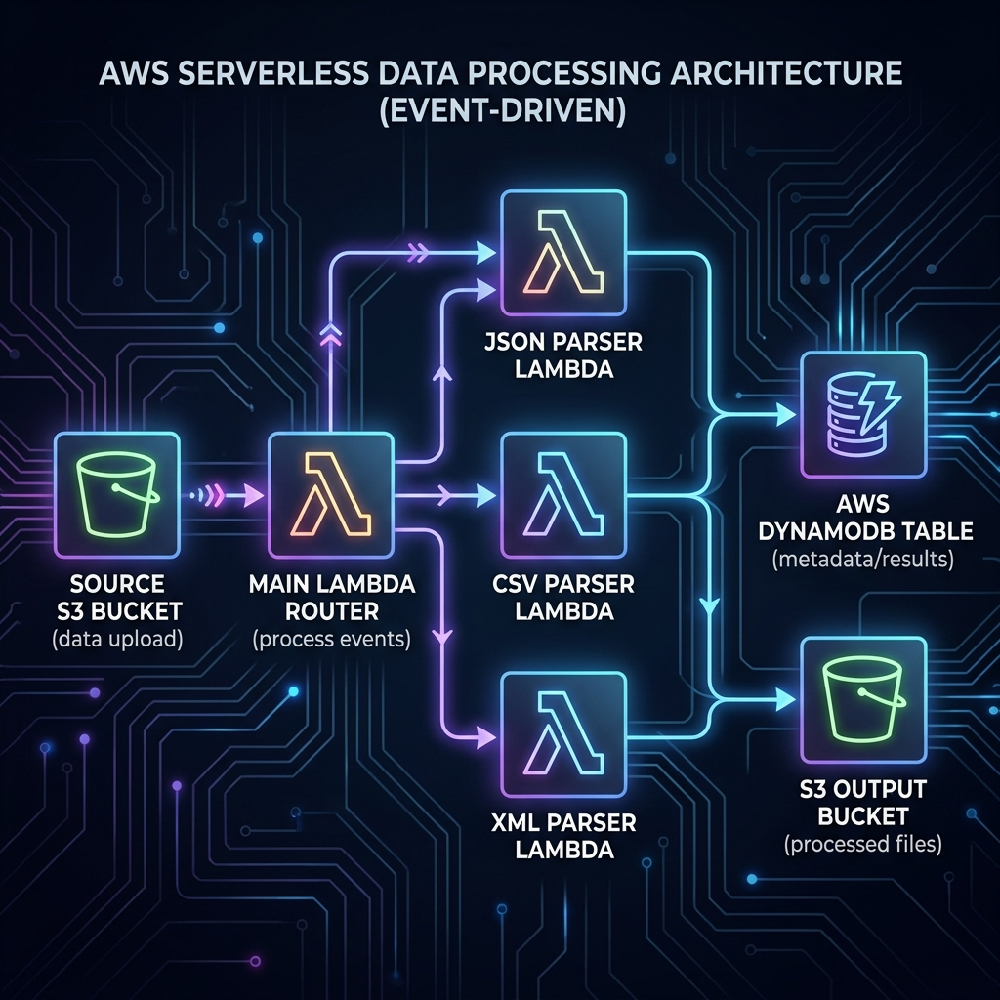
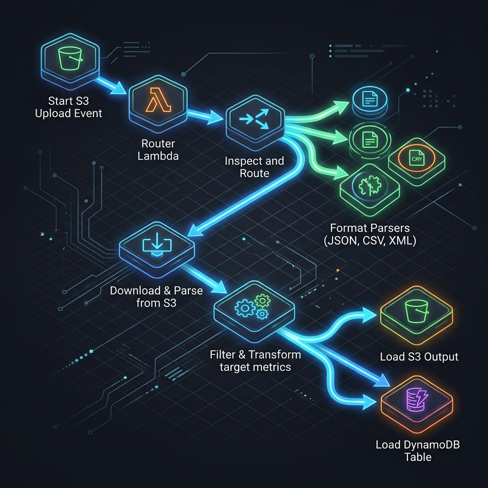

# COVID-19 ETL CI/CD Pipeline (S3 → Lambda Router → Individual Parsers → DynamoDB)

A modular, serverless ETL (Extract, Transform, Load) pipeline that processes COVID-19 datasets (supporting JSON, CSV, and XML file formats) uploaded to an S3 bucket, validates and extracts key state-level metrics, and loads the results into DynamoDB and an output S3 bucket. The entire lifecycle is validated using GitHub Actions and prepared for AWS deployment via AWS CodeBuild.

---

## Architecture Overview



---

## ETL Flow (Router & Parsers)




---

## Derived Metrics Calculation

| Output Key | Source Field (JSON / CSV / XML) | Calculation / Logic |
|---|---|---|
| `total_cases` | `confirmed` / `total_cases` | Directly parsed integer |
| `recovered` | `recovered` | Directly parsed integer |
| `deaths` | `deceased` / `deaths` | Directly parsed integer |
| `vaccination` | `vaccinated1` / `vaccination` | First-dose vaccination count |
| `non_vaccination` | `population` and `vaccination` | `population - vaccination` (unvaccinated count) |

---

## CI/CD Pipeline

```
Developer pushes code changes to GitHub
                 │
                 ├───────────────────────────────┐
                 ▼                               ▼
     ┌───────────────────────┐       ┌───────────────────────┐
     │  GitHub Actions (CI)  │       │   AWS CodeBuild (CD)  │
     │  .github/workflows/   │       │   buildspec.yml       │
     │  cicd.yml             │       │                       │
     │                       │       │  • Install Python 3.11│
     │  • Setup Python 3.11  │       │  • Install pip deps   │
     │  • Install pip deps   │       │  • Compile-check all  │
     │  • Syntax check files │       │    Lambda scripts     │
     │    (py_compile check) │       │  • Zip individual     │
     │                       │       │    lambda packages    │
     │  ✅ Success on valid  │       │                       │
     │  ❌ Fail on syntax    │       │  📦 Outputs:          │
     │     errors            │       │     - router.zip      │
     │                       │       │     - json.zip...     │
     └───────────────────────┘       └───────────────────────┘
```

---

## Dataset & Targets

* **Primary Dataset Source:** [inCOVID19 India COVID-19 API](https://data.incovid19.org/)
* **Monitored States:**
  * **MP** - Madhya Pradesh
  * **UP** - Uttar Pradesh
  * **KL** - Kerala
  * **AP** - Andhra Pradesh

---

## AWS Services Used

| Service | Role |
|---|---|
| **Amazon S3** | Data Lake — stores source uploads (`.json`, `.csv`, `.xml`) and output files |
| **AWS Lambda** | Modular ETL Engines — 1 Router Lambda + 3 Parser Lambdas |
| **Amazon DynamoDB** | Clean Record Store — stores final processed states data |
| **AWS IAM** | Execution roles giving Lambda permissions to S3, DynamoDB, and child Lambda invocation |
| **AWS CodeBuild** | Runs compilation validation and packages individual Lambda zip files |
| **GitHub Actions** | Automated CI pipeline checking syntax errors on push/pull requests |

---

## DynamoDB Table Design

* **Table name:** `covid_filtered_table`
* **Partition key:** `state` (String)
* **Capacity mode:** On-demand

```
state (PK) │ total_cases │ recovered │ deaths │ vaccination │ non_vaccination
───────────┼─────────────┼───────────┼────────┼─────────────┼────────────────
MP         │ 1054938     │ 1044140   │ 10786  │ 54378190    │ 18241902
UP         │ 2128103     │ 2102602   │ 23620  │ 154210982   │ 83610920
```

---

## Repository Structure

```
etl-s3-lambda-router-parsers/
├── README.md                      # Detailed System Documentation
├── lambda_function.py             # Router Lambda (routes events based on extension)
├── lambda_json.py                 # JSON parser Lambda
├── lambda_csv.py                  # CSV parser Lambda
├── lambda_xml.py                  # XML parser Lambda
├── lambda_fetch.py               # Fetcher Lambda (fetches COVID API -> uploads JSON/CSV/XML to S3)
├── requirements.txt               # Main python dependency file (boto3)
├── buildspec.yml                  # CodeBuild instructions to package Lambda ZIPs
└── .github/
    └── workflows/
        └── cicd.yml               # GitHub Actions: syntax verification on push/PR
```

---

## Setup & Testing Steps

### 1. S3 Buckets Setup
Create two S3 buckets in your AWS account:
* `covid-etl-source-bucket` (for raw data input)
* `covid-etl-output-bucket` (for clean output storage)

### 2. DynamoDB Table Setup
Create a DynamoDB table named `covid_filtered_table` with `state` as the Partition key (String).

### 3. Deploy Lambda Functions
1. Create five Lambda functions in the AWS Console (Python 3.11).
2. Upload the zipped code generated by your CodeBuild/pipeline or insert the raw code files:
   * **Fetcher Lambda**: `lambda_fetch.py`
   * **Router Lambda**: `lambda_function.py`
   * **JSON Parser**: `lambda_json.py`
   * **CSV Parser**: `lambda_csv.py`
   * **XML Parser**: `lambda_xml.py`
3. Configure environment variables:
   * For the **Fetcher Lambda**: Set `S3_SOURCE_BUCKET_NAME` = Name of your S3 source bucket.
   * For the **Parser Lambdas**: Set `OUTPUT_BUCKET_NAME` = Name of your output bucket, and `DYNAMODB_TABLE_NAME` = `covid_filtered_table`.
4. Configure permissions (IAM execution roles):
   * **Fetcher Lambda**: Needs S3 Write (`s3:PutObject`) permissions.
   * **Router Lambda**: Needs permission to execute/invoke parser functions (`lambda:InvokeFunction`).
   * **Parser Lambdas**: Needs S3 Read/Write (`s3:GetObject`, `s3:PutObject`) and DynamoDB Write (`dynamodb:PutItem`) permissions.

### 4. Create S3 event Notification
1. Open the source S3 bucket properties.
2. Under **Event notifications**, add a trigger on `All object create events` (`s3:ObjectCreated:*`).
3. Set the destination to the Router Lambda function (`covid-parser-router-lambda`).

### 5. Set up EventBridge Schedule (Automated Trigger)
To fetch daily data automatically:
1. Open the **Amazon EventBridge Console**.
2. Click **Create rule** and choose schedule (e.g. `rate(1 day)` or cron expression).
3. Set the target to invoke the `covid-fetcher-lambda` function.

### 6. Push Code & Trigger
* Push code to GitHub to verify CI/CD pipelines run cleanly.
* Trigger the `covid-fetcher-lambda` manually (or wait for the schedule) to fetch, convert, and push raw files to S3, which automatically routes and completes the ETL workflow.

---

## Reflection

**Why DynamoDB?**  
No servers to configure, scales instantly, and on-demand mode matches the intermittent execution pattern of file uploads (you pay $0 when no files are uploaded).

**Why partition key `state`?**  
Since we only filter and track specific states (`MP`, `UP`, `KL`, `AP`), the state code provides an ideal partition key that guarantees fast key-value retrieval for state summaries.

**What files should never be committed to GitHub?**  
`.env` files (confidential configuration), `*.zip` build artifacts (compilable from source), local virtual environments (`venv/`), and raw data mock logs (to prevent repo bloat).
